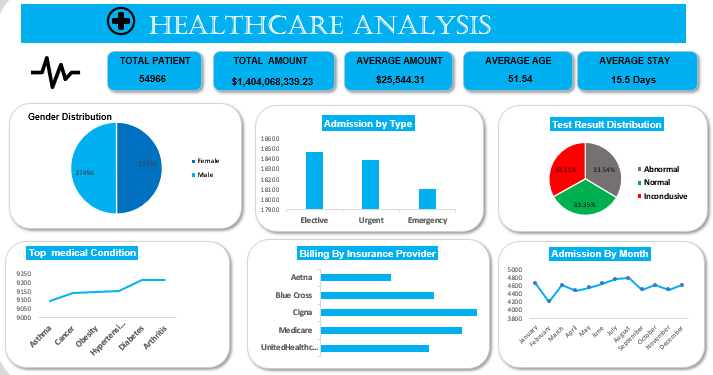

# Healthcare Patient Records Analysis

## Introduction
Hospitals and healthcare providers generate large volumes of patient data every year, including demographics, admissions, treatment, billing, and outcomes. Analyzing this data helps healthcare providers understand patient trends, improve care quality, and manage costs more effectively. This project focuses on analyzing a large patient records dataset to uncover patterns in demographics, medical conditions, admissions, billing, and test outcomes, presented through an interactive Excel dashboard.

## Problem Statement
Healthcare data is often large and unstructured, making it difficult to extract clear, actionable insights. The challenge in this project was to clean and explore the dataset to identify key patterns, such as which conditions are most common, how costs vary by insurance provider, and how admission types affect patient outcomes, in order to support better hospital resource planning and decision-making.

## Data Sourcing
The dataset is a healthcare patient records dataset.

**Records:** ~55,000 patient records

**Key Fields:**
- Patient demographics (age, gender)
- Medical condition
- Admission type (Elective, Urgent, Emergency)
- Billing amount and insurance provider
- Length of stay
- Medications
- Test results

## Data Transformation & Cleaning
- Removed duplicate and incomplete records
- Standardized inconsistent text entries (e.g. medical condition and admission type labels)
- Checked and corrected data types (dates, numeric billing values)
- Organized the cleaned data into a structured table for analysis

## Analytics and Measures
Built PivotTables to summarize and analyze the data, covering:
- Total patients, average billing amount, average patient age, and average length of stay
- Patient distribution by gender and admission type
- Test result breakdown (Normal, Abnormal, Inconclusive)
- Billing amount by insurance provider
- Admissions trend by month

## Dashboard & Visuals
Designed an interactive Excel dashboard combining KPI cards, charts, and tables, including:
- KPI cards for total patients, total/average billing amount, average age, and average stay
- Gender distribution chart
- Admission by type chart
- Test result distribution chart
- Top medical conditions chart
- Billing by insurance provider chart
- Admissions by month trend chart

## Insight and Findings
- The dataset covers 54,966 patients, generating a combined billing total of over $1.4 billion, with an average billing amount of $25,544.31 per patient.
- The average patient age was 51.5, with an average hospital stay of 15.5 days.
- The gender split was nearly even, with a slightly higher number of female patients than male.
- Elective admissions were the most common admission type, followed closely by urgent and emergency cases, with all three types fairly close in volume.
- Test results were almost evenly split in thirds between Normal, Abnormal, and Inconclusive outcomes, suggesting no strong bias toward any single result type.
- Chronic conditions such as Diabetes and Arthritis appeared more frequently than conditions like Asthma, pointing to a patient population skewing toward longer-term health conditions.
- Cigna stood out with the highest total billing among insurance providers, ahead of Medicare, Blue Cross, Aetna, and UnitedHealthcare.
- Patient admissions stayed fairly consistent month to month, with no extreme spikes or drops across the year.

## Recommendations
- Hospitals could use admission trends to plan staffing and resources ahead of higher-demand periods.
- Insurance providers with notably higher billing amounts could be reviewed for cost transparency.
- Further investigation into inconclusive test results could help improve diagnostic processes.

## Conclusion
This analysis demonstrates how cleaning and visualizing patient data can reveal meaningful patterns in demographics, costs, and outcomes. These insights can support healthcare providers in improving patient care and operational planning.
